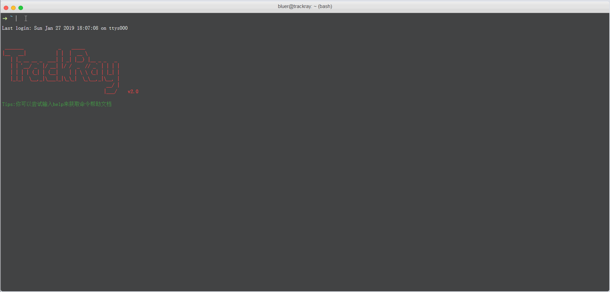
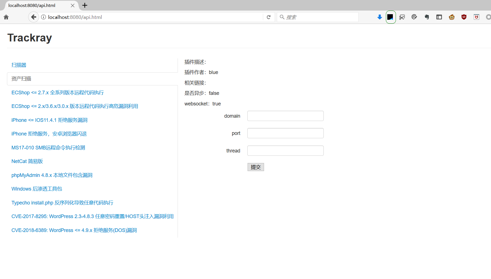
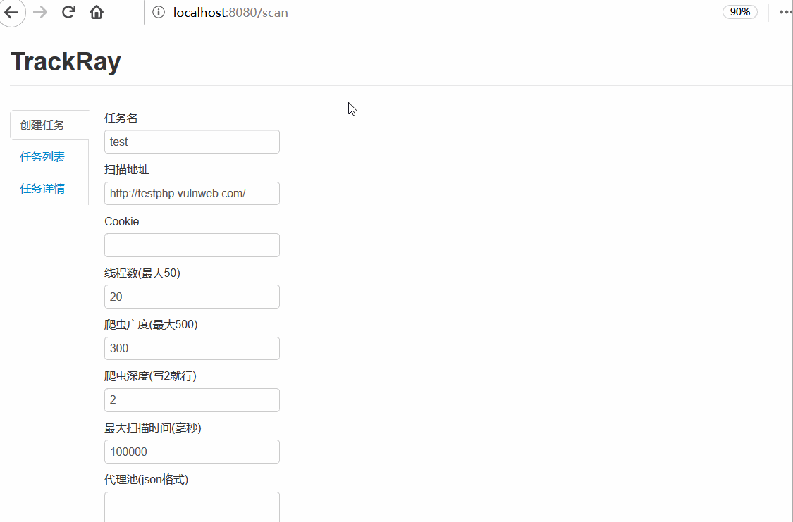

<pre>
 _______             _    _____             
|__   __|           | |  |  __ \            
   | |_ __ __ _  ___| | _| |__) |__ _ _   _ 
   | | '__/ _` |/ __| |/ /  _  // _` | | | |
   | | | | (_| | (__|    | | \ \ (_| | |_| |
   |_|_|  \__,_|\___|_|\_\_|  \_\__,_|\__, |
                                       __/ |
                                      |___/   v2.0
</pre>


## 关于溯光
该框架使用Java语言编写，自更新 2.0 版本后，项目数据库采用嵌入式数据库hsqldb，使用 SpringBoot 框架开发。

如有任何使用上的问题可发送邮件或联系我的私人微信，BUG请提交issue。

[官方网站](https://trackray.cn)

## 如何使用
* 安装nmap，写入环境变量
* 启动SQLMAP API
* 启动msfrpc服务 ```msfrpcd -U msf -P msf -S -f```
* 启动AWVS
* 在application.properties配置文件中修改 ```database.dir```及以上有变更的配置参数
* 编译并运行

## 功能展示

#### 交互式插件控制台


#### MSF 控制台


#### 无交互插件调用



#### 扫描器展示



## 插件

[plugin.md](plugin.md)


## 功能简介

[functions.md](functions.md)


## 贡献者
项目由[浅蓝](https://github.com/iSafeBlue)发起并主导

核心开发者：
* [浅蓝](https://github.com/iSafeBlue)
* ...


## 赞助

#### 您的捐助将被用于

* 持续开发溯光渗透测试框架
* ```trackray.cn```  域名续费
* 社区活动
* 奖励杰出贡献者

 


## 申明

溯光遵循 GPL 开源协议，请务必了解。

溯光开发的初衷是方便企业的安全研究者研究漏洞，检测漏洞。

我们严格禁止一切通过本程序进行的违反任何国家法律行为。

我们不会上传未公开的漏洞插件，也不允许插件中存在破坏性的语句，目前module模块只写了几个有代表性的模块供开发者参考。

使用本程序则默认视为你同意我们的规则，请您务必遵守道德与法律准则。

如不遵守，后果自负，开发者将不承担任何责任！
